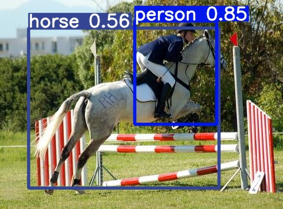

<div align="right">
  Language:
    🇺🇸
  <a title="Chinese" href="./README.zh-CN.md">🇨🇳</a>
</div>

<div align="center"><a title="" href="https://github.com/zjykzj/YOLOv2"></a></div>

<p align="center">
  «YOLOv2» reproduced the paper "YOLO9000: Better, Faster, Stronger"
<br>
<br>
  <a href="https://github.com/RichardLitt/standard-readme"></a>
  <a href="https://conventionalcommits.org"></a>
  <a href="http://commitizen.github.io/cz-cli/"></a>
</p>

* Train using the `VOC07+12 trainval` dataset and test using the `VOC2007 Test` dataset with an input size of `640x640`. give the result as follows

<!-- <style type="text/css">
.tg  {border-collapse:collapse;border-spacing:0;}
.tg td{border-color:black;border-style:solid;border-width:1px;font-family:Arial, sans-serif;font-size:14px;
  overflow:hidden;padding:10px 5px;word-break:normal;}
.tg th{border-color:black;border-style:solid;border-width:1px;font-family:Arial, sans-serif;font-size:14px;
  font-weight:normal;overflow:hidden;padding:10px 5px;word-break:normal;}
.tg .tg-b6ls{background-color:#FFF;border-color:inherit;color:#1F2328;font-weight:bold;text-align:center;vertical-align:top}
.tg .tg-23cg{background-color:#FFF;border-color:inherit;color:#1F2328;font-weight:bold;text-align:center;vertical-align:middle}
.tg .tg-baqh{text-align:center;vertical-align:top}
.tg .tg-vc3l{background-color:#FFF;border-color:inherit;color:#1F2328;text-align:center;vertical-align:top}
.tg .tg-c3ow{border-color:inherit;text-align:center;vertical-align:top}
.tg .tg-9y4h{background-color:#FFF;border-color:inherit;color:#1F2328;text-align:center;vertical-align:middle}
.tg .tg-d5y0{background-color:#FFF;color:#1F2328;text-align:center;vertical-align:top}
</style> -->
<table class="tg">
<thead>
  <tr>
    <th class="tg-b6ls"></th>
    <th class="tg-b6ls">Original (darknet)</th>
    <th class="tg-baqh"><span style="font-weight:700;font-style:normal">tztztztztz/yolov2.pytorch</span></th>
    <th class="tg-23cg"><span style="font-weight:var(--base-text-weight-semibold, 600)">zjykzj/YOLOv2(This)</span></th>
    <th class="tg-23cg"><span style="font-weight:var(--base-text-weight-semibold, 600)">zjykzj/YOLOv2(This)</span></th>
  </tr>
</thead>
<tbody>
  <tr>
    <td class="tg-9y4h">ARCH</td>
    <td class="tg-9y4h">YOLOv2</td>
    <td class="tg-d5y0">YOLOv2</td>
    <td class="tg-9y4h">YOLOv2</td>
    <td class="tg-9y4h">YOLOv2-Fast</td>
  </tr>
  <tr>
    <td class="tg-c3ow">GFLOPs</td>
    <td class="tg-c3ow">/</td>
    <td class="tg-baqh">/</td>
    <td class="tg-c3ow">69.7</td>
    <td class="tg-c3ow">48.8</td>
  </tr>
  <tr>
    <td class="tg-c3ow">DATASET(TRAIN)</td>
    <td class="tg-c3ow">VOC TRAINVAL 2007+2012</td>
    <td class="tg-baqh">VOC TRAINVAL 2007+2012</td>
    <td class="tg-c3ow">VOC TRAINVAL 2007+2012</td>
    <td class="tg-c3ow">VOC TRAINVAL 2007+2012</td>
  </tr>
  <tr>
    <td class="tg-vc3l">DATASET(VAL)</td>
    <td class="tg-9y4h">VOC TEST 2007</td>
    <td class="tg-d5y0">VOC TEST 2007</td>
    <td class="tg-vc3l">VOC TEST 2007</td>
    <td class="tg-vc3l">VOC TEST 2007</td>
  </tr>
  <tr>
    <td class="tg-9y4h">INPUT_SIZE</td>
    <td class="tg-9y4h">416x416</td>
    <td class="tg-d5y0">416x416</td>
    <td class="tg-9y4h">640x640</td>
    <td class="tg-vc3l">640x640</td>
  </tr>
  <tr>
    <td class="tg-c3ow">PRETRAINED</td>
    <td class="tg-c3ow">TRUE</td>
    <td class="tg-baqh">TRUE</td>
    <td class="tg-c3ow">FALSE</td>
    <td class="tg-c3ow">FALSE</td>
  </tr>
  <tr>
    <td class="tg-vc3l">COCO AP[IoU=0.50:0.95]</td>
    <td class="tg-vc3l">/</td>
    <td class="tg-baqh">/</td>
    <td class="tg-vc3l">47.8</td>
    <td class="tg-vc3l">34.8</td>
  </tr>
  <tr>
    <td class="tg-vc3l">COCO AP[IoU=0.50]</td>
    <td class="tg-vc3l">76.8</td>
    <td class="tg-baqh"><span style="font-weight:400;font-style:normal">72.7</span></td>
    <td class="tg-vc3l">74.6</td>
    <td class="tg-vc3l">65</td>
  </tr>
</tbody>
</table>

* Train using the `COCO train2017` dataset and test using the `COCO val2017` dataset with an input size of `640x640`. give the result as follows (*Note: The results of the original paper were evaluated on the `COCO test-dev2015` dataset*)

<!-- <style type="text/css">
.tg  {border-collapse:collapse;border-spacing:0;}
.tg td{border-color:black;border-style:solid;border-width:1px;font-family:Arial, sans-serif;font-size:14px;
  overflow:hidden;padding:10px 5px;word-break:normal;}
.tg th{border-color:black;border-style:solid;border-width:1px;font-family:Arial, sans-serif;font-size:14px;
  font-weight:normal;overflow:hidden;padding:10px 5px;word-break:normal;}
.tg .tg-b6ls{background-color:#FFF;border-color:inherit;color:#1F2328;font-weight:bold;text-align:center;vertical-align:top}
.tg .tg-23cg{background-color:#FFF;border-color:inherit;color:#1F2328;font-weight:bold;text-align:center;vertical-align:middle}
.tg .tg-baqh{text-align:center;vertical-align:top}
.tg .tg-vc3l{background-color:#FFF;border-color:inherit;color:#1F2328;text-align:center;vertical-align:top}
.tg .tg-9y4h{background-color:#FFF;border-color:inherit;color:#1F2328;text-align:center;vertical-align:middle}
.tg .tg-d5y0{background-color:#FFF;color:#1F2328;text-align:center;vertical-align:top}
</style> -->
<table class="tg">
<thead>
  <tr>
    <th class="tg-b6ls"></th>
    <th class="tg-b6ls">Original (darknet)</th>
    <th class="tg-23cg"><span style="font-weight:var(--base-text-weight-semibold, 600)">zjykzj/YOLOv2(This)</span></th>
    <th class="tg-23cg"><span style="font-weight:var(--base-text-weight-semibold, 600)">zjykzj/YOLOv2(This)</span></th>
  </tr>
</thead>
<tbody>
  <tr>
    <td class="tg-9y4h">ARCH</td>
    <td class="tg-9y4h">YOLOv2</td>
    <td class="tg-9y4h">YOLOv2</td>
    <td class="tg-9y4h">YOLOv2-Fast</td>
  </tr>
  <tr>
    <td class="tg-baqh">GFLOPs</td>
    <td class="tg-baqh">/</td>
    <td class="tg-baqh">69.7</td>
    <td class="tg-baqh">48.8</td>
  </tr>
  <tr>
    <td class="tg-baqh">DATASET(TRAIN)</td>
    <td class="tg-baqh">/</td>
    <td class="tg-baqh">COCO TRAIN2017</td>
    <td class="tg-baqh">COCO TRAIN2017</td>
  </tr>
  <tr>
    <td class="tg-vc3l">DATASET(VAL)</td>
    <td class="tg-9y4h">/</td>
    <td class="tg-vc3l">COCO VAL2017</td>
    <td class="tg-vc3l">COCO VAL2017</td>
  </tr>
  <tr>
    <td class="tg-9y4h">INPUT_SIZE</td>
    <td class="tg-9y4h">416x416</td>
    <td class="tg-9y4h">640x640</td>
    <td class="tg-vc3l">640x640</td>
  </tr>
  <tr>
    <td class="tg-baqh">PRETRAINED</td>
    <td class="tg-baqh">TRUE</td>
    <td class="tg-baqh">FALSE</td>
    <td class="tg-baqh">FALSE</td>
  </tr>
  <tr>
    <td class="tg-d5y0">COCO AP[IoU=0.50:0.95]</td>
    <td class="tg-d5y0">21.6</td>
    <td class="tg-d5y0">30.5</td>
    <td class="tg-d5y0">20.3</td>
  </tr>
  <tr>
    <td class="tg-d5y0">COCO AP[IoU=0.50]</td>
    <td class="tg-d5y0">44.0</td>
    <td class="tg-d5y0">48.5</td>
    <td class="tg-d5y0">37.4</td>
  </tr>
</tbody>
</table>

## Table of Contents

- [Table of Contents](#table-of-contents)
- [Latest News](#latest-news)
- [Background](#background)
- [Prepare Data](#prepare-data)
  - [Pascal VOC](#pascal-voc)
  - [COCO](#coco)
- [Installation](#installation)
  - [Requirements](#requirements)
  - [Container](#container)
- [Usage](#usage)
  - [Train](#train)
  - [Eval](#eval)
  - [Predict](#predict)
- [Maintainers](#maintainers)
- [Thanks](#thanks)
- [Contributing](#contributing)
- [License](#license)

## Latest News

* ***[2023/07/16][v0.3.0](https://github.com/zjykzj/YOLOv2/releases/tag/v0.3.0). Add [ultralytics/yolov5](https://github.com/ultralytics/yolov5)([485da42](https://github.com/ultralytics/yolov5/commit/485da42273839d20ea6bdaf142fd02c1027aba61)) transforms.***
* ***[2023/06/28][v0.2.1](https://github.com/zjykzj/YOLOv2/releases/tag/v0.2.1). Refactor data module.***
* ***[2023/05/21][v0.2.0](https://github.com/zjykzj/YOLOv2/releases/tag/v0.2.0). Reconstructed loss function and add Darknet53 as a backbone.***
* ***[2023/05/09][v0.1.2](https://github.com/zjykzj/YOLOv2/releases/tag/v0.1.2). Add COCO dataset result and update VOC dataset training results.***
* ***[2023/05/03][v0.1.1](https://github.com/zjykzj/YOLOv2/releases/tag/v0.1.1). Fix target transform and update `yolov2_voc.cfg` and `yolov2-tiny_voc.cfg` training results for VOC2007 Test.***
* ***[2023/05/02][v0.1.0](https://github.com/zjykzj/YOLOv2/releases/tag/v0.1.0). Complete YOLOv2 training/evaluation/prediction, while providing the evaluation results of VOC2007 Test.***

## Background

YOLOv2 has made more innovations on the basis of YOLOv1. For the network, it has created Darknet-19; For the loss function, it adds anchor box settings to help network training with more fine-grained features. Compared with YOLOv1, YOLOv2 is more modern and high-performance.

This repository references many repositories implementations, including [tztztztztz/yolov2.pytorch](https://github.com/tztztztztz/yolov2.pytorch) and [yjh0410/yolov2-yolov3_PyTorch](https://github.com/yjh0410/yolov2-yolov3_PyTorch), as well as [zjykzj/YOLOv3](https://github.com/zjykzj/YOLOv3).

## Prepare Data

### Pascal VOC

Use this script [voc2yolov5.py](https://github.com/zjykzj/vocdev/blob/master/py/voc2yolov5.py)

```shell
python voc2yolov5.py -s /home/zj/data/voc -d /home/zj/data/voc/voc2yolov5-train -l trainval-2007 trainval-2012
python voc2yolov5.py -s /home/zj/data/voc -d /home/zj/data/voc/voc2yolov5-val -l test-2007
```

Then softlink the folder where the dataset is located to the specified location:

```shell
ln -s /path/to/voc /path/to/YOLOv2/../datasets/voc
```

### COCO

Use this script [get_coco.sh](https://github.com/ultralytics/yolov5/blob/master/data/scripts/get_coco.sh)

## Installation

### Requirements

See [NVIDIA/apex](https://github.com/NVIDIA/apex)

### Container

Development environment (Use nvidia docker container)

```shell
docker run --gpus all -it --rm -v </path/to/YOLOv2>:/app/YOLOv2 -v </path/to/voc>:/app/datasets/voc nvcr.io/nvidia/pytorch:22.08-py3
```

## Usage

### Train

* One GPU

```shell
CUDA_VISIBLE_DEVICES=0 python main_amp.py -c configs/yolov2_voc.cfg --opt-level=O1 ../datasets/voc
```

* Multi-GPUs

```shell
CUDA_VISIBLE_DEVICES=0,1,2,3 python -m torch.distributed.launch --nproc_per_node=4 --master_port "32111" main_amp.py -c configs/yolov2_voc.cfg --opt-level=O1 ../datasets/voc
```

### Eval

```shell
python3 val.py --weights runs/train/yolov2_voc_wo_pretrained/weights/best.pt --data VOC.yaml --img 640 --device 0
                 Class     Images  Instances          P          R      mAP50   mAP50-95: 100%|██████████| 155/155 00:47
                   all       4952      12032      0.738      0.702      0.746      0.478
             aeroplane       4952        285      0.801      0.708      0.756      0.439
               bicycle       4952        337      0.871       0.78      0.869      0.561
                  bird       4952        459      0.699      0.641      0.701      0.429
                  boat       4952        263      0.636       0.62      0.647      0.357
                bottle       4952        469      0.702      0.588      0.622      0.359
                   bus       4952        213      0.815      0.761      0.834      0.632
                   car       4952       1201      0.806      0.857      0.873      0.616
                   cat       4952        358      0.777      0.723      0.789      0.526
                 chair       4952        756      0.615      0.595      0.597      0.361
                   cow       4952        244      0.673      0.693      0.743      0.492
           diningtable       4952        206      0.693      0.694      0.694        0.4
                   dog       4952        489      0.721       0.64      0.753      0.487
                 horse       4952        348      0.808      0.787      0.835      0.564
             motorbike       4952        325      0.832      0.751      0.832      0.532
                person       4952       4528       0.83      0.788      0.856      0.527
           pottedplant       4952        480      0.653      0.485      0.509      0.254
                 sheep       4952        242      0.631      0.752      0.756      0.533
                  sofa       4952        239      0.667      0.661       0.69       0.47
                 train       4952        282      0.753      0.791      0.793      0.496
             tvmonitor       4952        308      0.786      0.727       0.76      0.523
python3 val.py --weights runs/train/yolov2-fast_voc_wo_pretrained/weights/best.pt --data VOC.yaml --img 640 --device 0
                 Class     Images  Instances          P          R      mAP50   mAP50-95: 100%|██████████| 155/155 00:44
                   all       4952      12032      0.664      0.616       0.65      0.348
             aeroplane       4952        285      0.656      0.649      0.674      0.312
               bicycle       4952        337       0.78      0.695      0.789      0.458
                  bird       4952        459      0.627      0.505      0.583      0.295
                  boat       4952        263       0.53       0.57      0.526      0.246
                bottle       4952        469      0.653      0.505       0.51      0.254
                   bus       4952        213      0.677      0.679      0.694      0.439
                   car       4952       1201      0.738      0.774      0.804      0.491
                   cat       4952        358       0.69      0.606      0.654      0.306
                 chair       4952        756      0.593      0.479      0.519      0.282
                   cow       4952        244      0.629       0.68      0.694      0.415
           diningtable       4952        206      0.679      0.476      0.545      0.215
                   dog       4952        489      0.648      0.526      0.613       0.31
                 horse       4952        348      0.711      0.727       0.75      0.403
             motorbike       4952        325      0.732      0.692       0.76      0.407
                person       4952       4528       0.76      0.729      0.786      0.412
           pottedplant       4952        480      0.553      0.423      0.439      0.184
                 sheep       4952        242      0.655      0.711      0.731      0.462
                  sofa       4952        239      0.566       0.54      0.547        0.3
                 train       4952        282      0.656      0.695      0.678      0.344
             tvmonitor       4952        308      0.746      0.653        0.7      0.432
python3 val.py --weights runs/train/yolov2_coco_wo_pretrained/weights/best.pt --data coco.yaml --img 640
 Average Precision  (AP) @[ IoU=0.50:0.95 | area=   all | maxDets=100 ] = 0.305
 Average Precision  (AP) @[ IoU=0.50      | area=   all | maxDets=100 ] = 0.485
 Average Precision  (AP) @[ IoU=0.75      | area=   all | maxDets=100 ] = 0.325
 Average Precision  (AP) @[ IoU=0.50:0.95 | area= small | maxDets=100 ] = 0.133
 Average Precision  (AP) @[ IoU=0.50:0.95 | area=medium | maxDets=100 ] = 0.363
 Average Precision  (AP) @[ IoU=0.50:0.95 | area= large | maxDets=100 ] = 0.434
 Average Recall     (AR) @[ IoU=0.50:0.95 | area=   all | maxDets=  1 ] = 0.275
 Average Recall     (AR) @[ IoU=0.50:0.95 | area=   all | maxDets= 10 ] = 0.440
 Average Recall     (AR) @[ IoU=0.50:0.95 | area=   all | maxDets=100 ] = 0.467
 Average Recall     (AR) @[ IoU=0.50:0.95 | area= small | maxDets=100 ] = 0.209
 Average Recall     (AR) @[ IoU=0.50:0.95 | area=medium | maxDets=100 ] = 0.552
 Average Recall     (AR) @[ IoU=0.50:0.95 | area= large | maxDets=100 ] = 0.674
python3 val.py --weights runs/train/yolov2-fast_coco_wo_pretrained/weights/best.pt --data coco.yaml --img 640
 Average Precision  (AP) @[ IoU=0.50:0.95 | area=   all | maxDets=100 ] = 0.203
 Average Precision  (AP) @[ IoU=0.50      | area=   all | maxDets=100 ] = 0.374
 Average Precision  (AP) @[ IoU=0.75      | area=   all | maxDets=100 ] = 0.195
 Average Precision  (AP) @[ IoU=0.50:0.95 | area= small | maxDets=100 ] = 0.091
 Average Precision  (AP) @[ IoU=0.50:0.95 | area=medium | maxDets=100 ] = 0.288
 Average Precision  (AP) @[ IoU=0.50:0.95 | area= large | maxDets=100 ] = 0.278
 Average Recall     (AR) @[ IoU=0.50:0.95 | area=   all | maxDets=  1 ] = 0.215
 Average Recall     (AR) @[ IoU=0.50:0.95 | area=   all | maxDets= 10 ] = 0.358
 Average Recall     (AR) @[ IoU=0.50:0.95 | area=   all | maxDets=100 ] = 0.389
 Average Recall     (AR) @[ IoU=0.50:0.95 | area= small | maxDets=100 ] = 0.168
 Average Recall     (AR) @[ IoU=0.50:0.95 | area=medium | maxDets=100 ] = 0.481
 Average Recall     (AR) @[ IoU=0.50:0.95 | area= large | maxDets=100 ] = 0.549
```

### Predict

```shell
python detect.py --weights runs/yolov2_voc_wo_pretrained/weights/best.pt --source ./assets/voc2007-test/
```

<p align="left">  </p>

```shell
python detect.py --weights runs/yolov2_coco_wo_pretrained/weights/best.pt --source ./assets/coco/
```

<p align="left">  </p>

## Maintainers

* zhujian - *Initial work* - [zjykzj](https://github.com/zjykzj)

## Thanks

* [tztztztztz/yolov2.pytorch](https://github.com/tztztztztz/yolov2.pytorch)
* [AlexeyAB/darknet](https://github.com/AlexeyAB/darknet)
* [yjh0410/yolov2-yolov3_PyTorch](https://github.com/yjh0410/yolov2-yolov3_PyTorch)
* [zjykzj/YOLOv3](https://github.com/zjykzj/YOLOv3)
* [zjykzj/anchor-boxes](https://github.com/zjykzj/anchor-boxes)
* [zjykzj/vocdev](https://github.com/zjykzj/vocdev)
* [ultralytics/yolov5](https://github.com/ultralytics/yolov5)

## Contributing

Anyone's participation is welcome! Open an [issue](https://github.com/zjykzj/YOLOv2/issues) or submit PRs.

Small note:

* Git submission specifications should be complied
  with [Conventional Commits](https://www.conventionalcommits.org/en/v1.0.0-beta.4/)
* If versioned, please conform to the [Semantic Versioning 2.0.0](https://semver.org) specification
* If editing the README, please conform to the [standard-readme](https://github.com/RichardLitt/standard-readme)
  specification.

## License

[Apache License 2.0](LICENSE) © 2023 zjykzj