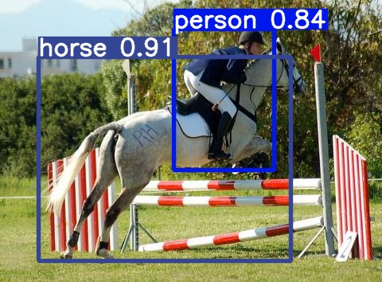
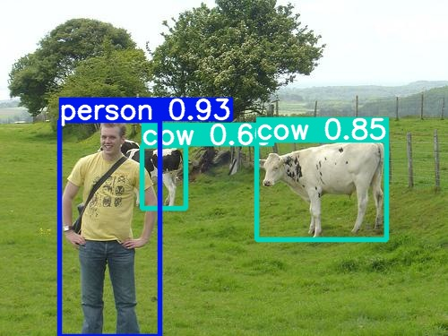
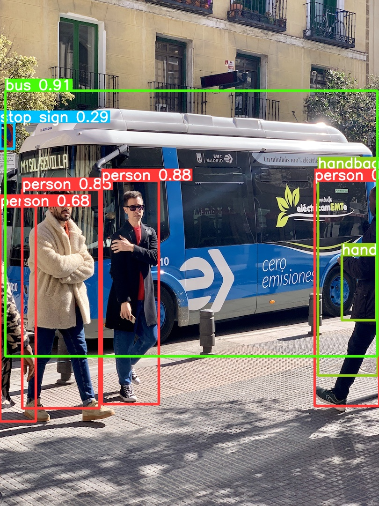
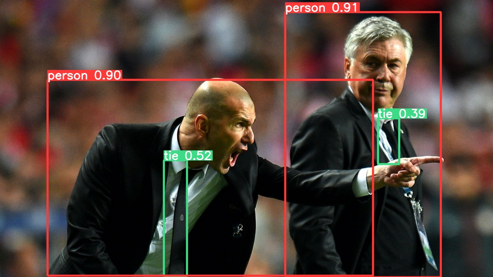

<div align="right">
  语言:
    🇨🇳
  <a title="英语" href="./README.md">🇺🇸</a>
</div>

<div align="center"><a title="" href="https://github.com/zjykzj/YOLOv2"></a></div>

<p align="center">
  «YOLOv2» 复现了论文 "YOLO9000: Better, Faster, Stronger"
<br>
<br>
  <a href="https://github.com/RichardLitt/standard-readme"></a>
  <a href="https://conventionalcommits.org"></a>
  <a href="http://commitizen.github.io/cz-cli/"></a>
</p>

* 使用`VOC07+12 trainval`数据集进行训练，使用`VOC2007 Test`进行测试，输入大小为`640x640`。测试结果如下：

<!-- <style type="text/css">
.tg  {border-collapse:collapse;border-spacing:0;}
.tg td{border-color:black;border-style:solid;border-width:1px;font-family:Arial, sans-serif;font-size:14px;
  overflow:hidden;padding:10px 5px;word-break:normal;}
.tg th{border-color:black;border-style:solid;border-width:1px;font-family:Arial, sans-serif;font-size:14px;
  font-weight:normal;overflow:hidden;padding:10px 5px;word-break:normal;}
.tg .tg-b6ls{background-color:#FFF;border-color:inherit;color:#1F2328;font-weight:bold;text-align:center;vertical-align:top}
.tg .tg-23cg{background-color:#FFF;border-color:inherit;color:#1F2328;font-weight:bold;text-align:center;vertical-align:middle}
.tg .tg-baqh{text-align:center;vertical-align:top}
.tg .tg-vc3l{background-color:#FFF;border-color:inherit;color:#1F2328;text-align:center;vertical-align:top}
.tg .tg-c3ow{border-color:inherit;text-align:center;vertical-align:top}
.tg .tg-9y4h{background-color:#FFF;border-color:inherit;color:#1F2328;text-align:center;vertical-align:middle}
.tg .tg-d5y0{background-color:#FFF;color:#1F2328;text-align:center;vertical-align:top}
</style> -->
<table class="tg">
<thead>
  <tr>
    <th class="tg-b6ls"></th>
    <th class="tg-b6ls">Original (darknet)</th>
    <th class="tg-baqh"><span style="font-weight:700;font-style:normal">tztztztztz/yolov2.pytorch</span></th>
    <th class="tg-23cg"><span style="font-weight:var(--base-text-weight-semibold, 600)">zjykzj/YOLOv2(This)</span></th>
    <th class="tg-23cg"><span style="font-weight:var(--base-text-weight-semibold, 600)">zjykzj/YOLOv2(This)</span></th>
  </tr>
</thead>
<tbody>
  <tr>
    <td class="tg-9y4h">ARCH</td>
    <td class="tg-9y4h">YOLOv2</td>
    <td class="tg-d5y0">YOLOv2</td>
    <td class="tg-9y4h">YOLOv2</td>
    <td class="tg-9y4h">YOLOv2-Fast</td>
  </tr>
  <tr>
    <td class="tg-c3ow">GFLOPs</td>
    <td class="tg-c3ow">/</td>
    <td class="tg-baqh">/</td>
    <td class="tg-c3ow">69.5</td>
    <td class="tg-c3ow">48.5</td>
  </tr>
  <tr>
    <td class="tg-c3ow">DATASET(TRAIN)</td>
    <td class="tg-c3ow">VOC TRAINVAL 2007+2012</td>
    <td class="tg-baqh">VOC TRAINVAL 2007+2012</td>
    <td class="tg-c3ow">VOC TRAINVAL 2007+2012</td>
    <td class="tg-c3ow">VOC TRAINVAL 2007+2012</td>
  </tr>
  <tr>
    <td class="tg-vc3l">DATASET(VAL)</td>
    <td class="tg-9y4h">VOC TEST 2007</td>
    <td class="tg-d5y0">VOC TEST 2007</td>
    <td class="tg-vc3l">VOC TEST 2007</td>
    <td class="tg-vc3l">VOC TEST 2007</td>
  </tr>
  <tr>
    <td class="tg-9y4h">INPUT_SIZE</td>
    <td class="tg-9y4h">416x416</td>
    <td class="tg-d5y0">416x416</td>
    <td class="tg-9y4h">640x640</td>
    <td class="tg-vc3l">640x640</td>
  </tr>
  <tr>
    <td class="tg-c3ow">PRETRAINED</td>
    <td class="tg-c3ow">TRUE</td>
    <td class="tg-baqh">TRUE</td>
    <td class="tg-c3ow">FALSE</td>
    <td class="tg-c3ow">FALSE</td>
  </tr>
  <tr>
    <td class="tg-vc3l">VOC AP[IoU=0.50:0.95]</td>
    <td class="tg-vc3l">/</td>
    <td class="tg-baqh">/</td>
    <td class="tg-vc3l">44.3</td>
    <td class="tg-vc3l">29.8</td>
  </tr>
  <tr>
    <td class="tg-vc3l">VOC AP[IoU=0.50]</td>
    <td class="tg-vc3l">76.8</td>
    <td class="tg-baqh"><span style="font-weight:400;font-style:normal">72.7</span></td>
    <td class="tg-vc3l">75.1</td>
    <td class="tg-vc3l">62.6</td>
  </tr>
</tbody>
</table>

* 使用`COCO train2017`数据集进行训练，使用`COCO val2017`数据集进行测试，输入大小为`640x640`。测试结果如下：（*注意：原始论文使用`COCO test-dev2015`的评估结果*）

<!-- <style type="text/css">
.tg  {border-collapse:collapse;border-spacing:0;}
.tg td{border-color:black;border-style:solid;border-width:1px;font-family:Arial, sans-serif;font-size:14px;
  overflow:hidden;padding:10px 5px;word-break:normal;}
.tg th{border-color:black;border-style:solid;border-width:1px;font-family:Arial, sans-serif;font-size:14px;
  font-weight:normal;overflow:hidden;padding:10px 5px;word-break:normal;}
.tg .tg-b6ls{background-color:#FFF;border-color:inherit;color:#1F2328;font-weight:bold;text-align:center;vertical-align:top}
.tg .tg-23cg{background-color:#FFF;border-color:inherit;color:#1F2328;font-weight:bold;text-align:center;vertical-align:middle}
.tg .tg-baqh{text-align:center;vertical-align:top}
.tg .tg-vc3l{background-color:#FFF;border-color:inherit;color:#1F2328;text-align:center;vertical-align:top}
.tg .tg-9y4h{background-color:#FFF;border-color:inherit;color:#1F2328;text-align:center;vertical-align:middle}
.tg .tg-d5y0{background-color:#FFF;color:#1F2328;text-align:center;vertical-align:top}
</style> -->
<table class="tg">
<thead>
  <tr>
    <th class="tg-b6ls"></th>
    <th class="tg-b6ls">Original (darknet)</th>
    <th class="tg-23cg"><span style="font-weight:var(--base-text-weight-semibold, 600)">zjykzj/YOLOv2(This)</span></th>
    <th class="tg-23cg"><span style="font-weight:var(--base-text-weight-semibold, 600)">zjykzj/YOLOv2(This)</span></th>
  </tr>
</thead>
<tbody>
  <tr>
    <td class="tg-9y4h">ARCH</td>
    <td class="tg-9y4h">YOLOv2</td>
    <td class="tg-9y4h">YOLOv2</td>
    <td class="tg-9y4h">YOLOv2-Fast</td>
  </tr>
  <tr>
    <td class="tg-baqh">GFLOPs</td>
    <td class="tg-baqh">/</td>
    <td class="tg-baqh">69.7</td>
    <td class="tg-baqh">48.8</td>
  </tr>
  <tr>
    <td class="tg-baqh">DATASET(TRAIN)</td>
    <td class="tg-baqh">/</td>
    <td class="tg-baqh">COCO TRAIN2017</td>
    <td class="tg-baqh">COCO TRAIN2017</td>
  </tr>
  <tr>
    <td class="tg-vc3l">DATASET(VAL)</td>
    <td class="tg-9y4h">/</td>
    <td class="tg-vc3l">COCO VAL2017</td>
    <td class="tg-vc3l">COCO VAL2017</td>
  </tr>
  <tr>
    <td class="tg-9y4h">INPUT_SIZE</td>
    <td class="tg-9y4h">416x416</td>
    <td class="tg-9y4h">640x640</td>
    <td class="tg-vc3l">640x640</td>
  </tr>
  <tr>
    <td class="tg-baqh">PRETRAINED</td>
    <td class="tg-baqh">TRUE</td>
    <td class="tg-baqh">FALSE</td>
    <td class="tg-baqh">FALSE</td>
  </tr>
  <tr>
    <td class="tg-d5y0">COCO AP[IoU=0.50:0.95]</td>
    <td class="tg-d5y0">21.6</td>
    <td class="tg-d5y0">28.6</td>
    <td class="tg-d5y0">20.1</td>
  </tr>
  <tr>
    <td class="tg-d5y0">COCO AP[IoU=0.50]</td>
    <td class="tg-d5y0">44.0</td>
    <td class="tg-d5y0">50.7</td>
    <td class="tg-d5y0">41.2</td>
  </tr>
</tbody>
</table>

## 内容列表

- [内容列表](#内容列表)
- [最近新闻](#最近新闻)
- [背景](#背景)
- [安装](#安装)
- [用法](#用法)
  - [训练](#训练)
  - [评估](#评估)
  - [预测](#预测)
- [主要维护人员](#主要维护人员)
- [致谢](#致谢)
- [参与贡献方式](#参与贡献方式)
- [许可证](#许可证)

## 最近新闻

* ***[2024/05/04][v1.0.0](https://github.com/zjykzj/YOLOv2/releases/tag/v1.0.0). 重构YOLOv2工程，集成yolov5-v7.0，重新实现YOLOv2/YOLOv2-fast以及YOLOv2Loss。***
* ***[2023/07/16][v0.3.0](https://github.com/zjykzj/YOLOv2/releases/tag/v0.3.0). 添加[ultralytics/yolov5](https://github.com/ultralytics/yolov5)([485da42](https://github.com/ultralytics/yolov5/commit/485da42273839d20ea6bdaf142fd02c1027aba61)) 预处理实现。***
* ***[2023/06/28][v0.2.1](https://github.com/zjykzj/YOLOv2/releases/tag/v0.2.1). 重构数据模块。***
* ***[2023/05/21][v0.2.0](https://github.com/zjykzj/YOLOv2/releases/tag/v0.2.0). 重构损失函数，并且增加了Darknet-53作为Backbone。***
* ***[2023/05/09][v0.1.2](https://github.com/zjykzj/YOLOv2/releases/tag/v0.1.2). 更新COCO数据集和VOC数据集的训练结果。***
* ***[2023/05/03][v0.1.1](https://github.com/zjykzj/YOLOv2/releases/tag/v0.1.1). 修复转换函数，并且更新了`yolov2_voc.cfg`和`yolov2-tiny_voc.cfg`在VOC2007 Test上的训练结果。***
* ***[2023/05/02][v0.1.0](https://github.com/zjykzj/YOLOv2/releases/tag/v0.1.0). 完成了YOLOv2的训练/评估/预测功能，同时提供了VOC2007 Test的测试结果。***

## 背景

YOLOv2在YOLOv1的基础上增加了很多的创新。对于网络结构，它创建了Darknet-19；对于损失函数，他设置锚点框来帮助网络更好的训练。相比于YOLOv1，YOLOv2拥有更好的性能。

本仓库参考了很多的实现，包括[tztztztztz/yolov2.pytorch](https://github.com/tztztztztz/yolov2.pytorch)、[yjh0410/yolov2-yolov3_PyTorch](https://github.com/yjh0410/yolov2-yolov3_PyTorch)和[zjykzj/YOLOv3](https://github.com/zjykzj/YOLOv3)。

注意：当前本仓库最新的实现完全基于[ultralytics/yolov5 v7.0](https://github.com/ultralytics/yolov5/releases/tag/v7.0)

## 安装

```shell
pip3 install -r requirements.txt
```

或者使用Docker Container

```shell
docker run -it --runtime nvidia --gpus=all --shm-size=16g -v /etc/localtime:/etc/localtime -v $(pwd):/workdir --workdir=/workdir --name yolov2 ultralytics/yolov5:latest
```

## 用法

### 训练

```shell
python3 train.py --data VOC.yaml --weights "" --cfg yolov2_voc.yaml --img 640 --device 0 --yolov2loss
python3 train.py --data VOC.yaml --weights "" --cfg yolov2-fast_voc.yaml --img 640 --device 0 --yolov2loss
python3 train.py --data coco.yaml --weights "" --cfg yolov2.yaml --img 640 --device 0 --yolov2loss
python3 train.py --data coco.yaml --weights "" --cfg yolov2-fast.yaml --img 640 --device 0 --yolov2loss
```

### 评估

```shell
# python3 val.py --weights runs/train/voc/exp/weights/best.pt --data VOC.yaml --img 640 --device 0
yolov2_voc summary: 53 layers, 50645053 parameters, 0 gradients, 69.5 GFLOPs
                 Class     Images  Instances          P          R      mAP50   mAP50-95: 100%|██████████| 155/155 00:41
                   all       4952      12032      0.735      0.711      0.751      0.443
Speed: 0.1ms pre-process, 3.1ms inference, 1.3ms NMS per image at shape (32, 3, 640, 640)
# python3 val.py --weights runs/train/voc/exp3/weights/best.pt --data VOC.yaml --img 640 --device 0
yolov2-fast_voc summary: 33 layers, 42367485 parameters, 0 gradients, 48.5 GFLOPs
                 Class     Images  Instances          P          R      mAP50   mAP50-95: 100%|██████████| 155/155 00:37
                   all       4952      12032      0.626      0.612      0.626      0.298
Speed: 0.1ms pre-process, 2.3ms inference, 1.5ms NMS per image at shape (32, 3, 640, 640)
# python3 val.py --weights runs/train/coco/exp/weights/best.pt --data coco.yaml --img 640 --device 0
yolov2 summary: 53 layers, 50952553 parameters, 0 gradients, 69.7 GFLOPs
                 Class     Images  Instances          P          R      mAP50   mAP50-95: 100%|██████████| 157/157 00:57
                   all       5000      36335      0.627       0.48      0.507      0.286
Speed: 0.1ms pre-process, 3.1ms inference, 2.0ms NMS per image at shape (32, 3, 640, 640)
# python3 val.py --weights runs/train/coco/exp2/weights/best.pt --data coco.yaml --img 640 --device 0
yolov2-fast summary: 33 layers, 42674985 parameters, 0 gradients, 48.8 GFLOPs
                 Class     Images  Instances          P          R      mAP50   mAP50-95: 100%|██████████| 157/157 00:53
                   all       5000      36335      0.549      0.402      0.412      0.201
Speed: 0.1ms pre-process, 2.4ms inference, 2.1ms NMS per image at shape (32, 3, 640, 640)
```

### 预测

```shell
python3 detect.py --weights runs/yolov2_voc.pt --source ./assets/voc2007-test/
```

<p align="left">  </p>

```shell
python3 detect.py --weights runs/yolov2_coco.pt --source ./assets/coco/
```

<p align="left">  </p>

## 主要维护人员

* zhujian - *Initial work* - [zjykzj](https://github.com/zjykzj)

## 致谢

* [zjykzj/vocdev](https://github.com/zjykzj/vocdev)
* [zjykzj/YOLOv3](https://github.com/zjykzj/YOLOv3)
* [zjykzj/anchor-boxes](https://github.com/zjykzj/anchor-boxes)
* [ultralytics/yolov5](https://github.com/ultralytics/yolov5)
* [AlexeyAB/darknet](https://github.com/AlexeyAB/darknet)
* [tztztztztz/yolov2.pytorch](https://github.com/tztztztztz/yolov2.pytorch)
* [yjh0410/yolov2-yolov3_PyTorch](https://github.com/yjh0410/yolov2-yolov3_PyTorch)

## 参与贡献方式

欢迎任何人的参与！打开[issue](https://github.com/zjykzj/YOLOv2/issues)或提交合并请求。

注意:

* `GIT`提交，请遵守[Conventional Commits](https://www.conventionalcommits.org/en/v1.0.0-beta.4/)规范
* 语义版本化，请遵守[Semantic Versioning 2.0.0](https://semver.org)规范
* `README`编写，请遵守[standard-readme](https://github.com/RichardLitt/standard-readme)规范

## 许可证

[Apache License 2.0](LICENSE) © 2023 zjykzj