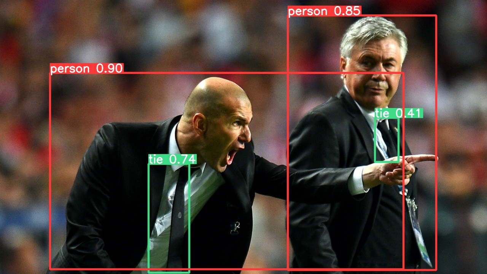

<div align="right">
  语言:
    🇨🇳
  <a title="英语" href="./README.md">🇺🇸</a>
</div>

<div align="center"><a title="" href="https://github.com/zjykzj/YOLOv2"></a></div>

<p align="center">
  «YOLOv2» 复现了论文 "YOLO9000: Better, Faster, Stronger"
<br>
<br>
  <a href="https://github.com/RichardLitt/standard-readme"></a>
  <a href="https://conventionalcommits.org"></a>
  <a href="http://commitizen.github.io/cz-cli/"></a>
</p>

* 使用`VOC07+12 trainval`数据集进行训练，使用`VOC2007 Test`进行测试，输入大小为`416x416`。测试结果如下：

<!-- <style type="text/css">
.tg  {border-collapse:collapse;border-spacing:0;}
.tg td{border-color:black;border-style:solid;border-width:1px;font-family:Arial, sans-serif;font-size:14px;
  overflow:hidden;padding:10px 5px;word-break:normal;}
.tg th{border-color:black;border-style:solid;border-width:1px;font-family:Arial, sans-serif;font-size:14px;
  font-weight:normal;overflow:hidden;padding:10px 5px;word-break:normal;}
.tg .tg-zkss{background-color:#FFF;border-color:inherit;color:#333;text-align:center;vertical-align:top}
.tg .tg-c3ow{border-color:inherit;text-align:center;vertical-align:top}
.tg .tg-fr9f{background-color:#FFF;border-color:inherit;color:#333;font-weight:bold;text-align:center;vertical-align:top}
.tg .tg-y5w1{background-color:#FFF;border-color:inherit;color:#00E;font-weight:bold;text-align:center;vertical-align:top}
</style> -->
<table class="tg">
<thead>
  <tr>
    <th class="tg-fr9f"></th>
    <th class="tg-fr9f"><span style="font-style:normal">Original (darknet)</span></th>
    <th class="tg-y5w1">tztztztztz/yolov2.pytorch</th>
    <th class="tg-y5w1">zjykzj/YOLOv2(This)</th>
    <th class="tg-y5w1">zjykzj/YOLOv2(This)</th>
    <th class="tg-c3ow">zjykzj/YOLOv2(This)</th>
  </tr>
</thead>
<tbody>
  <tr>
    <td class="tg-fr9f">ARCH</td>
    <td class="tg-zkss">YOLOv2</td>
    <td class="tg-zkss">YOLOv2</td>
    <td class="tg-zkss">YOLOv2+Darknet53</td>
    <td class="tg-zkss">YOLOv2</td>
    <td class="tg-zkss">YOLOv2-tiny</td>
  </tr>
  <tr>
    <td class="tg-fr9f">VOC AP[IoU=0.50]</td>
    <td class="tg-zkss">76.8</td>
    <td class="tg-zkss">72.7</td>
    <td class="tg-zkss">74.95(<a href="https://github.com/zjykzj/YOLOv2/releases/tag/v0.3.0">v0.3.0</a>)/76.33(<a href="https://github.com/zjykzj/YOLOv2/releases/tag/v0.2.1">v0.2.1</a>)</td>
    <td class="tg-zkss">73.27</td>
    <td class="tg-c3ow">65.44</td>
  </tr>
</tbody>
</table>

* 使用`COCO train2017`数据集进行训练，使用`COCO val2017`数据集进行测试，输入大小为`416x416`。测试结果如下：（*注意：原始论文使用`COCO test-dev2015`的评估结果*）

<!-- <style type="text/css">
.tg  {border-collapse:collapse;border-spacing:0;}
.tg td{border-color:black;border-style:solid;border-width:1px;font-family:Arial, sans-serif;font-size:14px;
  overflow:hidden;padding:10px 5px;word-break:normal;}
.tg th{border-color:black;border-style:solid;border-width:1px;font-family:Arial, sans-serif;font-size:14px;
  font-weight:normal;overflow:hidden;padding:10px 5px;word-break:normal;}
.tg .tg-zkss{background-color:#FFF;border-color:inherit;color:#333;text-align:center;vertical-align:top}
.tg .tg-c3ow{border-color:inherit;text-align:center;vertical-align:top}
.tg .tg-fr9f{background-color:#FFF;border-color:inherit;color:#333;font-weight:bold;text-align:center;vertical-align:top}
.tg .tg-y5w1{background-color:#FFF;border-color:inherit;color:#00E;font-weight:bold;text-align:center;vertical-align:top}
.tg .tg-9y4h{background-color:#FFF;border-color:inherit;color:#1F2328;text-align:center;vertical-align:middle}
</style> -->
<table class="tg">
<thead>
  <tr>
    <th class="tg-fr9f"></th>
    <th class="tg-fr9f"><span style="font-style:normal">Original (darknet)</span></th>
    <th class="tg-y5w1">zjykzj/YOLOv2(This)</th>
    <th class="tg-y5w1">zjykzj/YOLOv2(This)</th>
  </tr>
</thead>
<tbody>
  <tr>
    <td class="tg-fr9f">ARCH</td>
    <td class="tg-zkss">YOLOv2</td>
    <td class="tg-zkss">YOLOv2+Darknet53</td>
    <td class="tg-zkss">YOLOv2</td>
  </tr>
  <tr>
    <td class="tg-fr9f">COCO AP[IoU=0.50:0.95]</td>
    <td class="tg-zkss">21.6</td>
    <td class="tg-9y4h">25.86</td>
    <td class="tg-9y4h">22.84</td>
  </tr>
  <tr>
    <td class="tg-fr9f">COCO AP[IoU=0.50]</td>
    <td class="tg-c3ow">44.0</td>
    <td class="tg-9y4h">48.40</td>
    <td class="tg-9y4h">43.95</td>
  </tr>
</tbody>
</table>

## 内容列表

- [内容列表](#内容列表)
- [最近新闻](#最近新闻)
- [背景](#背景)
- [数据准备](#数据准备)
  - [Pascal VOC](#pascal-voc)
  - [COCO](#coco)
- [安装](#安装)
  - [需求](#需求)
  - [容器](#容器)
- [用法](#用法)
  - [训练](#训练)
  - [评估](#评估)
  - [示例](#示例)
- [主要维护人员](#主要维护人员)
- [致谢](#致谢)
- [参与贡献方式](#参与贡献方式)
- [许可证](#许可证)

## 最近新闻

* ***[2023/07/16][v0.3.0](https://github.com/zjykzj/YOLOv2/releases/tag/v0.3.0). 添加[ultralytics/yolov5](https://github.com/ultralytics/yolov5)([485da42](https://github.com/ultralytics/yolov5/commit/485da42273839d20ea6bdaf142fd02c1027aba61)) 预处理实现。***
* ***[2023/06/28][v0.2.1](https://github.com/zjykzj/YOLOv2/releases/tag/v0.2.1). 重构数据模块。***
* ***[2023/05/21][v0.2.0](https://github.com/zjykzj/YOLOv2/releases/tag/v0.2.0). 重构损失函数，并且增加了Darknet-53作为Backbone。***
* ***[2023/05/09][v0.1.2](https://github.com/zjykzj/YOLOv2/releases/tag/v0.1.2). 更新COCO数据集和VOC数据集的训练结果。***
* ***[2023/05/03][v0.1.1](https://github.com/zjykzj/YOLOv2/releases/tag/v0.1.1). 修复转换函数，并且更新了`yolov2_voc.cfg`和`yolov2-tiny_voc.cfg`在VOC2007 Test上的训练结果。***
* ***[2023/05/02][v0.1.0](https://github.com/zjykzj/YOLOv2/releases/tag/v0.1.0). 完成了YOLOv2的训练/评估/预测功能，同时提供了VOC2007 Test的测试结果。***

## 背景

YOLOv2在YOLOv1的基础上增加了很多的创新。对于网络结构，它创建了Darknet-19；对于损失函数，他设置锚点框来帮助网络更好的训练。相比于YOLOv1，YOLOv2拥有更好的性能。

本仓库参考了很多的实现，包括[tztztztztz/yolov2.pytorch](https://github.com/tztztztztz/yolov2.pytorch)、[yjh0410/yolov2-yolov3_PyTorch](https://github.com/yjh0410/yolov2-yolov3_PyTorch)和[zjykzj/YOLOv3](https://github.com/zjykzj/YOLOv3)。

## 数据准备

### Pascal VOC

使用脚本[voc2yolov5.py](https://github.com/zjykzj/vocdev/blob/master/py/voc2yolov5.py)

```shell
python voc2yolov5.py -s /home/zj/data/voc -d /home/zj/data/voc/voc2yolov5-train -l trainval-2007 trainval-2012
python voc2yolov5.py -s /home/zj/data/voc -d /home/zj/data/voc/voc2yolov5-val -l test-2007
```

然后将数据集所在的文件夹软链接到指定位置：

```shell
ln -s /path/to/voc /path/to/YOLOv1/../datasets/voc
```

### COCO

使用脚本[get_coco.sh](https://github.com/ultralytics/yolov5/blob/master/data/scripts/get_coco.sh)

## 安装

### 需求

查看[NVIDIA/apex](https://github.com/NVIDIA/apex)

### 容器

开发环境（使用nvidia docker容器）

```shell
docker run --gpus all -it --rm -v </path/to/YOLOv1>:/app/YOLOv1 -v </path/to/voc>:/app/datasets/voc nvcr.io/nvidia/pytorch:22.08-py3
```

## 用法

### 训练

* 单个GPU

```shell
CUDA_VISIBLE_DEVICES=0 python main_amp.py -c configs/yolov2_voc.cfg --opt-level=O1 ../datasets/voc
```

* 多个GPUs

```shell
CUDA_VISIBLE_DEVICES=0,1,2,3 python -m torch.distributed.launch --nproc_per_node=4 --master_port "32111" main_amp.py -c configs/yolov2_voc.cfg --opt-level=O1 ../datasets/voc
```

### 评估

```shell
python eval.py -c configs/yolov2_d53_voc.cfg -ckpt outputs/yolov2_d53_voc/model_best.pth.tar ../datasets/voc
VOC07 metric? Yes                                                                                                                                                                                                  
AP for aeroplane = 0.7804                                                                                                                                                                                          
AP for bicycle = 0.8453                                                                                                                                                                                            
AP for bird = 0.7612                                                                                                                                                                                               
AP for boat = 0.6260                                                                                                                                                                                               
AP for bottle = 0.5240                                                                                                                                                                                             
AP for bus = 0.8261                                                                                                                                                                                                
AP for car = 0.8244                                                                                                                                                                                                
AP for cat = 0.8635
AP for chair = 0.5690
AP for cow = 0.8161
AP for diningtable = 0.7046
AP for dog = 0.8470
AP for horse = 0.8398
AP for motorbike = 0.8014
AP for person = 0.7673
AP for pottedplant = 0.5069
AP for sheep = 0.7639
AP for sofa = 0.7374
AP for train = 0.8268
AP for tvmonitor = 0.7581
Mean AP = 0.7495
python eval.py -c configs/yolov2_voc.cfg -ckpt outputs/yolov2_voc/model_best.pth.tar ../datasets/voc
VOC07 metric? Yes
AP for aeroplane = 0.7396
AP for bicycle = 0.7876
AP for bird = 0.7264
AP for boat = 0.6345
AP for bottle = 0.4606
AP for bus = 0.7885
AP for car = 0.7927
AP for cat = 0.8630
AP for chair = 0.5502
AP for cow = 0.8029
AP for diningtable = 0.7024
AP for dog = 0.8457
AP for horse = 0.8374
AP for motorbike = 0.8048
AP for person = 0.7514
AP for pottedplant = 0.4933
AP for sheep = 0.7716
AP for sofa = 0.7068
AP for train = 0.8618
AP for tvmonitor = 0.7328
Mean AP = 0.7327
python eval.py -c configs/yolov2-tiny_voc.cfg -ckpt outputs/yolov2-tiny_voc/model_best.pth.tar ../datasets/voc
VOC07 metric? Yes
AP for aeroplane = 0.6745
AP for bicycle = 0.7511
AP for bird = 0.6245
AP for boat = 0.5421
AP for bottle = 0.3319
AP for bus = 0.7508
AP for car = 0.7413
AP for cat = 0.8123
AP for chair = 0.4276
AP for cow = 0.7286
AP for diningtable = 0.6336
AP for dog = 0.7646
AP for horse = 0.8083
AP for motorbike = 0.7378
AP for person = 0.6835
AP for pottedplant = 0.3593
AP for sheep = 0.6390
AP for sofa = 0.6519
AP for train = 0.7772
AP for tvmonitor = 0.6479
Mean AP = 0.6544
python eval.py -c configs/yolov2_d53_coco.cfg -ckpt outputs/yolov2_d53_coco/model_best.pth.tar --traversal ../datasets/coco
 Average Precision  (AP) @[ IoU=0.50:0.95 | area=   all | maxDets=100 ] = 0.259
 Average Precision  (AP) @[ IoU=0.50      | area=   all | maxDets=100 ] = 0.484
 Average Precision  (AP) @[ IoU=0.75      | area=   all | maxDets=100 ] = 0.249
 Average Precision  (AP) @[ IoU=0.50:0.95 | area= small | maxDets=100 ] = 0.071
 Average Precision  (AP) @[ IoU=0.50:0.95 | area=medium | maxDets=100 ] = 0.285
 Average Precision  (AP) @[ IoU=0.50:0.95 | area= large | maxDets=100 ] = 0.440
 Average Recall     (AR) @[ IoU=0.50:0.95 | area=   all | maxDets=  1 ] = 0.233
 Average Recall     (AR) @[ IoU=0.50:0.95 | area=   all | maxDets= 10 ] = 0.341
 Average Recall     (AR) @[ IoU=0.50:0.95 | area=   all | maxDets=100 ] = 0.351
 Average Recall     (AR) @[ IoU=0.50:0.95 | area= small | maxDets=100 ] = 0.110
 Average Recall     (AR) @[ IoU=0.50:0.95 | area=medium | maxDets=100 ] = 0.387
 Average Recall     (AR) @[ IoU=0.50:0.95 | area= large | maxDets=100 ] = 0.585
python eval.py -c configs/yolov2_coco.cfg -ckpt outputs/yolov2_coco/model_best.pth.tar --traversal ../datasets/coco
 Average Precision  (AP) @[ IoU=0.50:0.95 | area=   all | maxDets=100 ] = 0.228
 Average Precision  (AP) @[ IoU=0.50      | area=   all | maxDets=100 ] = 0.440
 Average Precision  (AP) @[ IoU=0.75      | area=   all | maxDets=100 ] = 0.217
 Average Precision  (AP) @[ IoU=0.50:0.95 | area= small | maxDets=100 ] = 0.052
 Average Precision  (AP) @[ IoU=0.50:0.95 | area=medium | maxDets=100 ] = 0.237
 Average Precision  (AP) @[ IoU=0.50:0.95 | area= large | maxDets=100 ] = 0.402
 Average Recall     (AR) @[ IoU=0.50:0.95 | area=   all | maxDets=  1 ] = 0.216
 Average Recall     (AR) @[ IoU=0.50:0.95 | area=   all | maxDets= 10 ] = 0.313
 Average Recall     (AR) @[ IoU=0.50:0.95 | area=   all | maxDets=100 ] = 0.324
 Average Recall     (AR) @[ IoU=0.50:0.95 | area= small | maxDets=100 ] = 0.092
 Average Recall     (AR) @[ IoU=0.50:0.95 | area=medium | maxDets=100 ] = 0.344
 Average Recall     (AR) @[ IoU=0.50:0.95 | area= large | maxDets=100 ] = 0.561
```

### 示例

```shell
python demo.py -c 0.6 configs/yolov2_voc.cfg outputs/yolov2_voc/model_best.pth.tar --exp voc assets/voc2007-test/
```

<p align="left">  </p>

```shell
python demo.py -c 0.6 configs/yolov2_coco.cfg outputs/yolov2_coco/model_best.pth.tar --exp coco assets/coco/
```

<p align="left">  </p>

## 主要维护人员

* zhujian - *Initial work* - [zjykzj](https://github.com/zjykzj)

## 致谢

* [tztztztztz/yolov2.pytorch](https://github.com/tztztztztz/yolov2.pytorch)
* [AlexeyAB/darknet](https://github.com/AlexeyAB/darknet)
* [yjh0410/yolov2-yolov3_PyTorch](https://github.com/yjh0410/yolov2-yolov3_PyTorch)
* [zjykzj/YOLOv3](https://github.com/zjykzj/YOLOv3)
* [zjykzj/anchor-boxes](https://github.com/zjykzj/anchor-boxes)
* [zjykzj/vocdev](https://github.com/zjykzj/vocdev)
* [ultralytics/yolov5](https://github.com/ultralytics/yolov5)

## 参与贡献方式

欢迎任何人的参与！打开[issue](https://github.com/zjykzj/YOLOv2/issues)或提交合并请求。

注意:

* `GIT`提交，请遵守[Conventional Commits](https://www.conventionalcommits.org/en/v1.0.0-beta.4/)规范
* 语义版本化，请遵守[Semantic Versioning 2.0.0](https://semver.org)规范
* `README`编写，请遵守[standard-readme](https://github.com/RichardLitt/standard-readme)规范

## 许可证

[Apache License 2.0](LICENSE) © 2023 zjykzj